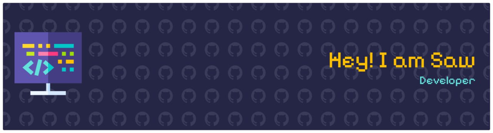

## Hello world! I'm Saw 👋

#### Skills

#### Contact Me

 

#### Github Stats

  
  

#### Play Game With Me

###

<picture>
  <source media="(prefers-color-scheme: dark)" srcset="https://raw.githubusercontent.com/OnlySaw/OnlySaw/output/pacman-contribution-graph-dark.svg">
  <source media="(prefers-color-scheme: light)" srcset="https://raw.githubusercontent.com/OnlySaw/OnlySaw/output/pacman-contribution-graph.svg">
  
</picture>

###
